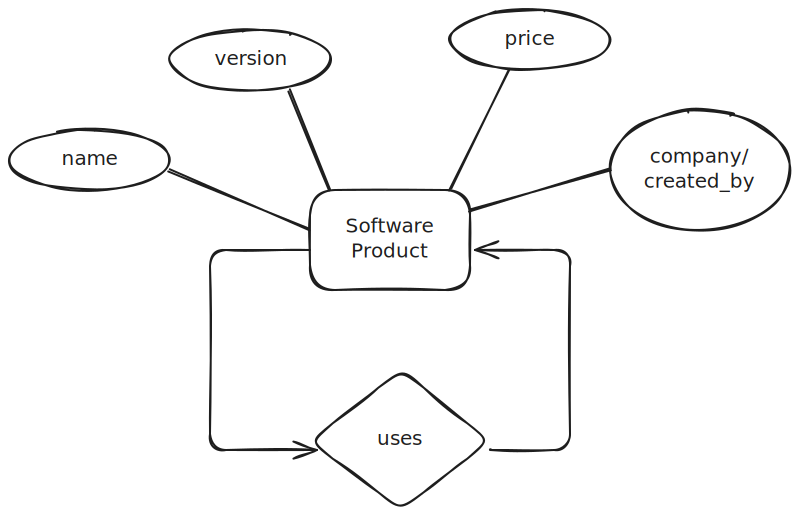

# Database Concepts Exercise 5

Create ER schemas for the following use cases. Provide key attributes for entities and
cardinalities for relationships. Avoid redundancies. Add missing information accor-
ding to the task.

## 1. Your task is to design a database about software products. Every software pro-
## duct has a name, a version number, a price and is created by a software company.
## It must be possible to store different versions of a software product. Additional-
## ly, some software products require other software products to run (e.g., Oracle8i
## requires Java). Thereby, a software product can be required by more than one
## other software product or not at all.
## Prepare an entity-relationship schema of the requested database about software
## products!

## 2. The government needs a database about universities and their faculties. A uni-
## versity has a unique name, an address and a number of enrolled students. Mo-
## reover, every university has at least two faculties. Thereby, faculties belong to
## exactly one university. Within one university, faculties are uniquely identified
## by their name. That means, faculties of different universities can have the same
## name. Additionally, for every faculty the name of the faculty's head must be
## stored.
## Prepare an entity-relationship schema of the requested database about univer-
## sities!

