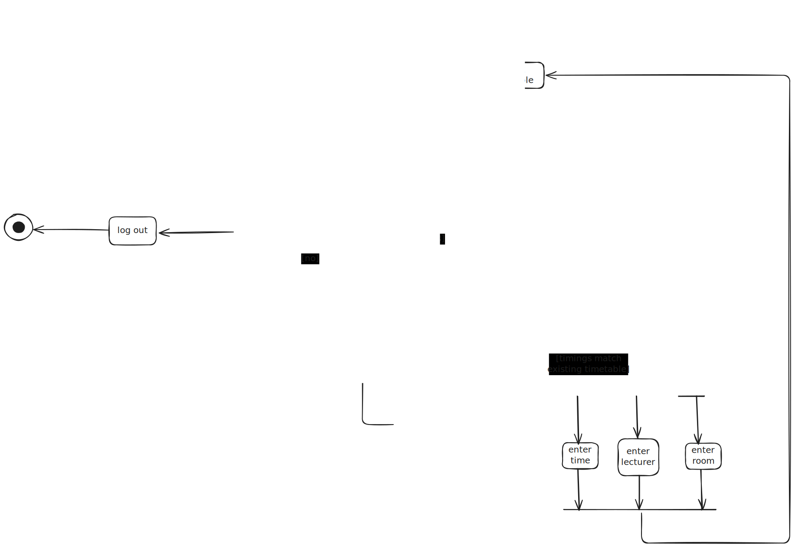
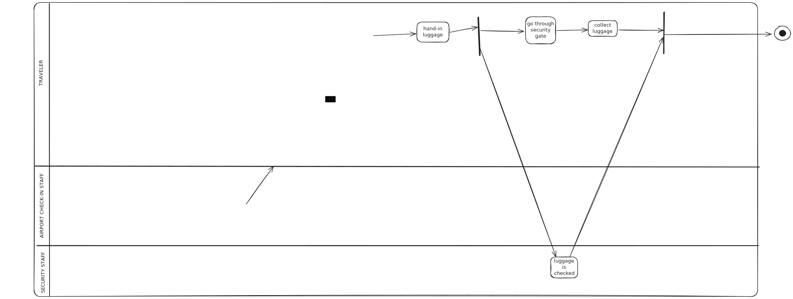

# Exercise 4 - Activity Diagrams

## Learning objective

Activity diagrams describe the behavior of a system, especially workflows. In this task, you will create activity diagrams based on written descriptions and practise their syntax.

## Task 1 - Timetable from the LSF

Create an activity diagram for the following scenario!

Students can create timetables using the LSF. First, they have to log in to the LSF. They then search for suitable courses that they want to take in the semester. Once they have found a course, they check the course times. If the times overlap with another course time, the course is discarded and you can either search for other courses or end the search. If the event times match your existing timetable, the system enters the time, lecturer and room for the event in question at the same time. Once each item has been entered, students can check their timetable again and decide whether they want to add more courses to their timetable or whether they have entered all the subjects they want. When the search is complete, students log out of LSF and the process is finished.

## Task 2 - Airport handling

Create an activity diagram for the following scenario! In this example, swimlanes should also be used.

A traveler goes to the baggage check-in at the airport to check in her suitcase. She places her suitcase on the baggage carousel. The baggage staff then weigh the suitcase. If the suitcase is too heavy, the traveler has to repack something. Once she has repacked, she must put the baggage down again and the baggage staff must then weigh the suitcase again, which may again be too heavy. If the luggage is too heavy and the customer does not want to repack, she can also pay an additional charge. The traveler then proceeds to the security check. There she hands in her hand luggage. While this is being checked by security staff, she goes through the security gate and then collects her luggage again. This area can only be left once both the traveler and her baggage have been checked.

