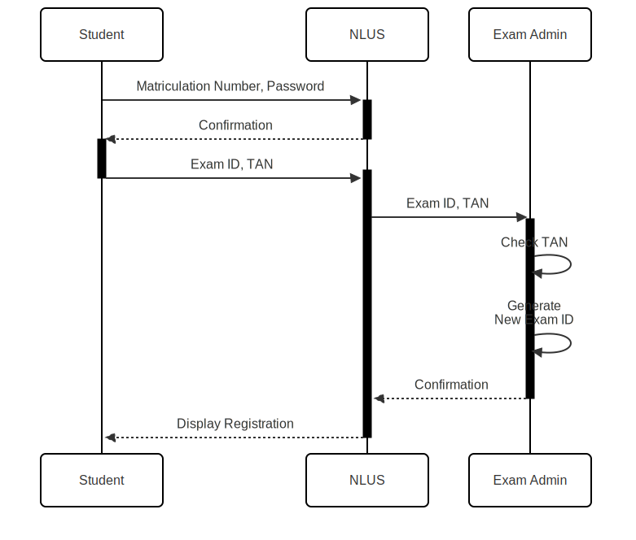

# Exercise 4 - Sequence Diagrams

## Learning objective

Sequence diagrams describe the exchange of messages between different elements of a system. In this task, you will use written descriptions to create sequence diagrams and practise their syntax.
Task 1 - Exam registration

## Task 1 - Exam registration

Create a sequence diagram for the following scenario!

To register for an exam, students have to log in to NLUS (Next Level University System) with their matriculation number and password. The NLUS sends back a confirmation directly. The student can then register for an exam in the NLUS using the exam ID and a TAN. The NLUS forwards the exam ID and the TAN to the exam administration. The exam administration checks the TAN first. It then generates a new exam registration using the exam ID. The created exam registration is sent back to the NLUS as a confirmation from the exam administration. The NLUS has been waiting for the confirmation until now. Now the NLUS displays the received exam registration to the student.

Here's what it looks like as an image:

## Task 2 - Pharmacies

Create a sequence diagram for the following scenario!

To ensure a sufficient supply of medication, pharmacies must obtain new deliveries from wholesalers via the automated APOS system. For this purpose, a sensor is placed in the warehouse that warns the APOS when the stock of a medicine is almost empty by means of the ID of the medicine. APOS checks the status with the ID again and generates a repeat order with the corresponding ID. After the order, APOS checks whether the repeat order matches the ID. After checking, the APOS sends a message of arrival to the sensor, which is confirmed directly by the sensor. The repeat order is then deleted.

Here's what it looks like as an image:

