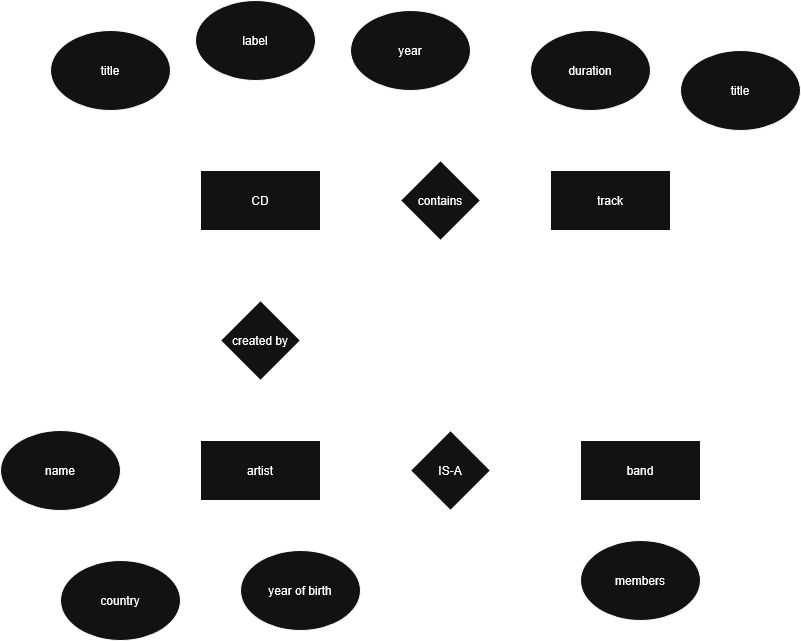

# Advanced Database Models Exercise 1

Author: Suvansh Shukla
Immatriculation Number: 256245

## Question 1

The different terms used in the statement relate to basic terms introduced in the lecture in different ways. Some of the ways the terms are related are in the following ways:

- data model: this refers to the model that describes in an abstract way how data is represented. The statement describes the data model as "Java".
- database model: this refers to the data model for a database system. In the context of the given system it refers to "object-relational".
- database schema: this is the map of concepts and their relationships for a specific universe of discourse. In the given system it refers to ER-diagram.
- database: this is a collection of facts in a given universe of discourse. In the given system it refers to "CRMPlus"
- database system: this refers to the entire system consisting of both the database and database management system. In the given system it refers to the combination of "CRMPlus" + "Oracle 10g".
- database management system: this refers to the software used to manage a database. In the given system it refers to "Oracle 10g"
- ORM: this is the framework that allows us mapping of database data to the object in an object-oriented programming language. Here it refers to "Hibernate".

## Question 2

Conceptual Design: 

Logical Design (using RM):

```text
CD(title, label, year)
track(duration, title)
artist(name, country, year_of_birth)
band(name, country, members)
```

Data definition (using SQL):

```SQL
CREATE TABLE cd(
    title VARCHAR(256) PRIMARY KEY,
    label VARCHAR(200),
    year INT
);

CREATE TABLE track(
    title VARCHAR(200) PRIMARY KEY,
    duration INT
);

CREATE TABLE artist(
    name VARCHAR(200) PRIMARY KEY,
    country VARCHAR(100),
    year_of_birth INT
);

CREATE TABLE band(
    name VARCHAR(200) PRIMARY KEY,
    country VARCHAR(100),
    members VARCHAR(256)
);
```

Physical Design (using SQL):

```SQL
CREATE TABLE artist (
    name VARCHAR(200) PRIMARY KEY,
    country VARCHAR(100),
    year_of_birth INT
);

CREATE TABLE band (
    name VARCHAR(200) PRIMARY KEY,
    country VARCHAR(100),
    members VARCHAR(256)
);

CREATE TABLE cd (
    title VARCHAR(256) PRIMARY KEY,
    label VARCHAR(200),
    year INT,
    artist_name VARCHAR(200),
    band_name VARCHAR(200),
    FOREIGN KEY (artist_name) REFERENCES artist(name),
    FOREIGN KEY (band_name) REFERENCES band(name),
    
    CONSTRAINT chk_performer CHECK (
        (artist_name IS NOT NULL AND band_name IS NULL) OR 
        (artist_name IS NULL AND band_name IS NOT NULL)
    )
);

CREATE TABLE track (
    song_title VARCHAR(200),
    cd_title VARCHAR(256),
    duration INT,
    PRIMARY KEY (song_title, cd_title),
    FOREIGN KEY (cd_title) REFERENCES cd(title) ON DELETE CASCADE
);
```

Using other models or languages would change the ER diagram dramatically. Especially in the case of No-SQL, there would be no need to such an ER diagram.

The data structures may use inheritance according to my design, a `band` would inherit properties from `artist`. Other things such as a `cd` would contain a `List` of `tracks`, thereby emulating `one-to-many` mapping. Hibernate (via it's annotations) would be used to denote the mappings.

The code for the java implementation would look something like this:

```Java
import jakarta.persistence.*;
import java.io.Serializable;

@Entity
@Inheritance(strategy = InheritanceType.JOINED)
public abstract class Performer {
    @Id
    private String name;

    private String country;

    // Getters and Setters
}

@Entity
public class Artist extends Performer {
    private Integer yearOfBirth;
}

@Entity
public class Band extends Performer {
    private String members; // Stored as a string per your requirements
}

@Entity
public class CD {
    @Id
    private String title;

    private String label;
    private Integer year;

    @ManyToOne
    @JoinColumn(name = "performer_name")
    private Performer performer;

    @OneToMany(mappedBy = "cd", cascade = CascadeType.ALL, orphanRemoval = true)
    private List<Track> tracks = new ArrayList<>();

    // Getters and Setters
}


// Helper class for the Composite Key
class TrackId implements Serializable {
    private String songTitle;
    private String cd; // Must match the field name in Track class
}

@Entity
@IdClass(TrackId.class)
public class Track {
    @Id
    private String songTitle;

    @Id
    @ManyToOne
    @JoinColumn(name = "cd_title")
    private CD cd;

    private Integer duration;

    // Getters and Setters
}
```
