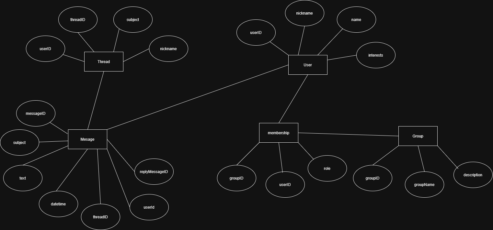

# Advanced Database Models Exercise 3

Author: Suvansh Shukla
Immatriculation Number: 256245

## Question 1

### Q1 Part (a)



### Q1 Part (b)

Yes, `subject` is redundant.

| Normal Form | Conforms | Reason |
| ----------- | -------- | ------ |
|    1NF      |  ✔       |        |
|    2NF      |  ❌      | Because in `subject` in `thread` table can be same for multiple `threadID` values, therefore not dependent on the PK |
|    3NF      |  ❌      | Because the schema is not in 2NF |

> [!Question]
> If `subject` duplicate values for different `threadID` then does it mean that 2NF is not satisfied?

## Question 2

### Q2 1

```relational_algebra
π(messageID, subject, text, datetime, threadID, userID, replyMessageID) σ(nickname='elwood')(message ⨝ (userID = userID) user)
```

### Q2 2

```relational_algebra
π(userID, nickname, name) σ(groupname='zanzibar')(group ⨝ (groupID = groupID) membership ⨝ user (userID = userID))
```

### Q2 3

```relational_algebra
π(messageID, subject, text, datetime, threadID, userID, replyMessageID) σ(subject='New Neil Young album out!')(thread ⨝ (threadID = threadID) message)
```

### Q2 4

```relational_algebra
π(messageID, subject, text, datetime, threadID, userID, replyMessageID) σ(subject='New Ron Sexsmith album out!')(thread ⨝ (threadID = threadID) message)
```

> [!NOTE]
> In relational algebra, the order of tuples in a relation has no meaning or importance, hence there is no established way to write it/include it

### Q2 5

```relational_algebra
π(threadID, subject, userID, nickname) σ(groupname='kiddies')(thread ⨝ (threadID = threadID) ⨝  membership ⨝ (groupID = groupID) group)```

### Q2 6

```relational_algebra

```

### Q2 7

```relational_algebra
π(userID, nickname, name, interests) σ(messageID=NULL)(message ⨝ (userID=userID) user))
```

```relational_algebra
π(userID)(user) \ π(userID)(message)
```

> [!NOTE]
> Anti-join is used to find non-existence in relational algebra, instead of `=NULL` approach

### Q2 8

```relational_algebra

