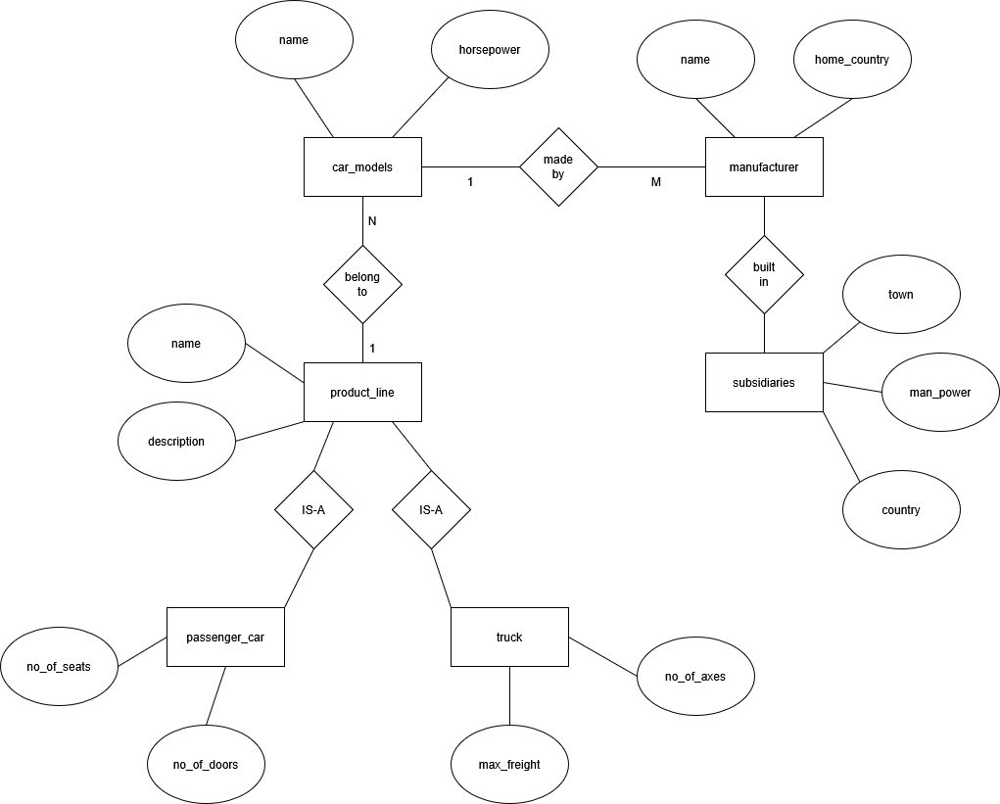
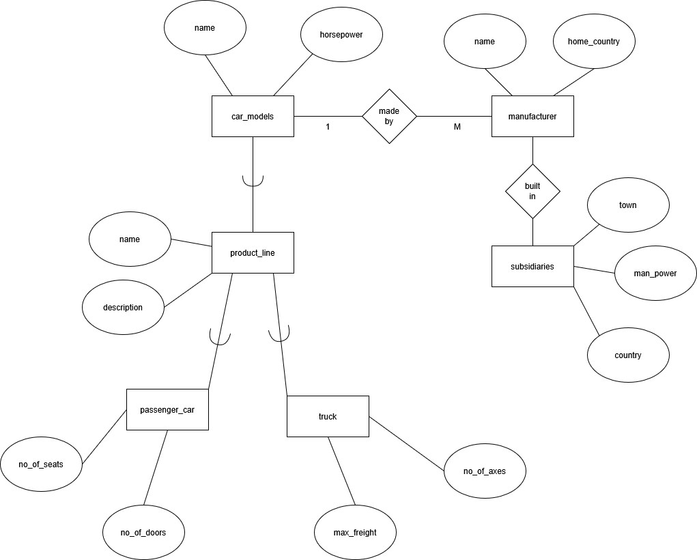
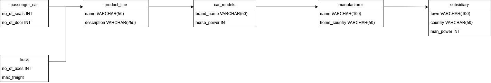

# Advanced Database Models Exercise 4

Author: Suvansh Shukla
Immatriculation Number: 256245

## Question 1 Conceptual Design

### Q1 (a)



### Q1 (b)



### Q1 (c)



## Question 2 Conceptual Design to Logical Design

### Q2 (a)

```RM
artist(ID, name, influenced_by, influences)
singer(s_id, artist_id, sex)
song_writer(sw_id, artist_id, genre)
singer_song_writer(s_id, sw_id)
songs(id, title, duration, s_id, sw_id)
```
