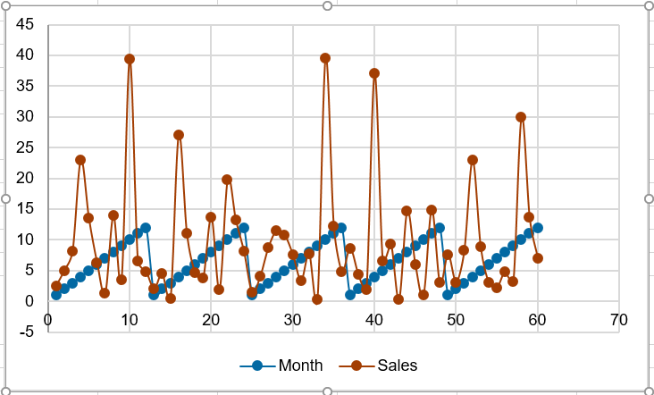

# Data Mining - II (WiSe 25/26)

Author: Suvansh Shukla  
Matriculation No. 256245

---

## Q1

### Part A

**Trend**: A time series has a trend if and only if there is a long-term increase or decrease in the observed values, following an arbitrary increase (or decrease) pattern

**Seasonality**: a time series has seasonality if and only if next to a trend, there are also patterns that repeat in relatively constant intervals (a.k.a cyclic patterns)

**Residue**: a time series has residue if a component that captures the short term fluctuations - which are not systematic and cannot be predicted.

**Autocorrelation**: refers to the correlation of a series with its own past (lagged) values. It helps identify the dynamics of the data (e.g., how strongly past values influence current ones).

Explanation with sample graph:

In this graph we can see that the overall **trend** is upwards (increasing), while the **seasonality** is the recurring peaks or highs encountered every 12 months. The **residue** is the unpredictable move upward of points as time goes on. The **autocorrelation** is how much higher the trade value is than it was 1 month, 2 month or even 12 months ago.

### Part B

The decomposition of a time series may be additive or multiplicative.

The decomposition is additive if all components use the same quantity as the time series at a timepoint.

$$Z_t = T_t + S_t + R_t$$

Where,

- Z is the time series
- T is the trend
- S is the seasonality
- R is the residue

The decomposition is multiplicative if the trend of the time series uses the same quantity unit as the time series and the other two components (seasonality and residue) are modifiers over the trend component.

$$Z_t = T_t \times S_t \times R_t$$

Where,

- Z is the time series
- T is the trend
- S is the seasonality
- R is the residue

## Q2

### Part (A)

Stationarity is when the statistical characteristics of the data distribution doesn't change, like if the mean, variance etc. don't change over time then the data is stationary. If mean, variance & other statistical data do change then there is no Stationarity. Stationarity allows patterns learned from the past to remain valid in the future.

The Augmented Dicky Fuller test is a statistical test that can be used to determine if a time series is stationary. The null hypothesis for this test states that the time series is stationary by default. If the p-value < 0.05 then we reject the null hypothesis and infer that the time series is stationary.

### Part (B)

Stationarity is important in a time series, because if a time series is not stationary then it makes forecasting a time series' future much more difficult and it invalidates many standard time-serise models.

A non-stationary time series can be converted into a stationary time series by using "differencing". Other transformations, such as logarithmic scaling or seasonal differencing, may also be used to stabilize variance or remove seasonality.

## Q3

### Part I

For both parts I think no, neither of them can be attributed to a marketing leaad leaving or being hired.

## Q4

Previous 3 values for calculating MA(3):

| Date    | Month | Values      |
| ------- | ----- | ----------- |
| 1953-10 |   10  | 29.93074538 |
| 1953-11 |   11  | 13.62159241 |
| 1953-12 |   12  | 7.040296112 |

$$MA(3) = \frac{3.194324806 + 29.93074538 + 13.62159241}{3} = 15.58222087$$

Previous 6 values for calculating MA(6):

| Date    | Month | Values      |
| ------- | ----- | ----------- |
| 1953-07 |   7   | 2.242249795 |
| 1953-08 |   8   | 4.825766594 |
| 1953-09 |   9   | 3.194324806 |
| 1953-10 |   1   | 29.93074538 |
| 1953-11 |   1   | 13.62159241 |
| 1953-12 |   1   | 7.040296112 |

$$MA(6) = \frac{3.007575027 + 2.242249795 + 4.825766594 + 3.194324806 + 29.93074538 + 13.62159241}{6} = 9.470375669$$

We have two predicted values of 1953-12, we will calculate the absolute error agains both of them:

$$Absolute\ Error = ∣Actual − Predicted∣$$

Against the first prediction MA(3):

$$Absolute\ Error = ∣7.040296112 − 16.8642113∣ = 8.541924758$$

Agains the second prediction MA(6):

$$Absolute\ Error = ∣7.040296112 − 10.14249585| = 3.102199738$$

Other values of Moving Average:

- MA(9) = 10.77418972
- MA(12) = 9.225157042
- MA(15) = 8.841092785
- MA(18) = 8.718867214
- MA(21) = 9.643545254

