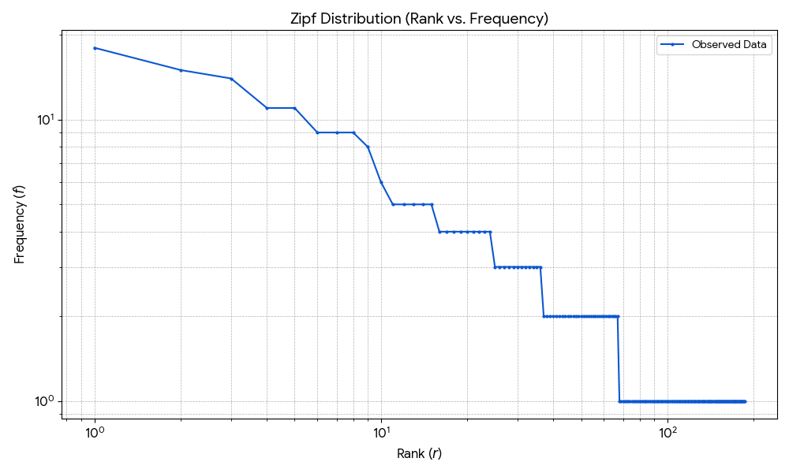

# Assignment 2 Information Retrieval (WS 2025/2026)

Suvansh Shukla (Matriculation Number: 256245)

---

## 1. Document in Information Retrieval (IR) Context

A document in the context of Information Retrieval (IR) is the primary unit of information that an IR system indexes, stores, and retrieves.

- It is the digital representation of a piece of content (like a webpage, email, book, article, or even a text snippet as provided) that is searched over.

- The goal of an IR system is to find the most relevant documents in a large collection in response to a user's query.

## 2. Terms, Tokens, and Types

These three concepts are fundamental to document processing in IR, where the text is broken down for indexing.

| Concept | Meaning in IR | "Example from ""Sunny Berlin! Berlin is always exciting!""" |
| ------- | ------------- | ----------------------------------------------------------- |
| Token | "An instance of a sequence of characters in the text, usually separated by whitespace or punctuation. It is the basic unit resulting from the first processing step (tokenization)." | "Sunny, Berlin, !, Berlin, is, always, exciting, ! (8 tokens)"|
| Type | The unique vocabulary term in the document. It is the canonical form of a token, often after normalization (e.g., lowercasing, stemming). | sunny, berlin, is, always, exciting, ! (6 types) |
| Term | A type that is chosen to be included in the system's index. Terms are the features used to match documents against a query. They are typically types that have undergone further processing like stopping (removal of common words) and stemming (reduction to root form). |sunny, berlin, always, exciting (After removing 'is' and '!' as stop words) |

In short: A token is an occurrence; a type is a unique form; and a term is a unique, processed type used for indexing.

## 3. Document Pre-processing Steps (First 3)

The text snippet:

> It’s the sunniest day this week. Yesterday was cloudy. Anna is in Berlin today. Sunny Berlin! Berlin is always exciting! To be or not to be.

Here are the first three common pre-processing steps applied to the snippet:

Step 1: Tokenization

- Purpose: To break the stream of text into discrete, smaller units called tokens. This is usually done by splitting the text based on delimiters like whitespace and punctuation.

- Result (Partial): `['It', '’', 's', 'the', 'sunniest', 'day', 'this', 'week', '.', 'Yesterday', 'was', 'cloudy', '.', 'Anna', 'is', 'in', 'Berlin', 'today', '.', 'Sunny', 'Berlin', '!', 'Berlin', 'is', 'always', 'exciting', '!', 'To', 'be', 'or', 'not', 'to', 'be', '.']`

- Challenge: Handling hyphenated words (e.g., 'state-of-the-art') and contractions (e.g., 'It’s', 'don't') consistently. Punctuation that is part of a term (e.g., '$500') or should be discarded needs careful rules.

Step 2: Normalization (Case Folding)

- Purpose: To convert all tokens to a consistent, common case (typically lowercase) so that the system treats, for example, 'Berlin', 'berlin', and 'BERLIN' as the same word. This increases recall.

- Applied to Step 1 Result: All tokens are converted to lowercase.

- Result (Partial): `['it', '’', 's', 'the', 'sunniest', 'day', 'this', 'week', '.', 'yesterday', 'was', 'cloudy', '.', 'anna', 'is', 'in', 'berlin', 'today', '.', 'sunny', 'berlin', '!', 'berlin', 'is', 'always', 'exciting', '!', 'to', 'be', 'or', 'not', 'to', 'be', '.']`

- Challenge: Losing information where case is significant (e.g., distinguishing between a proper noun like 'Paris' and a common noun like 'paris' (the plaster)). For most IR, lowercasing is standard, but some applications might need to preserve case.

## Step 3: Stop Word Removal

- Purpose: To eliminate extremely common words (called stop words), such as 'the', 'a', 'is', 'to', 'be', 'or', 'not', etc., that have little discriminative power for ranking documents. This dramatically reduces the index size and improves efficiency.

- Applied to Step 2 Result: Removing common stop words like 'it', 'the', 'this', 'was', 'is', 'in', 'to', 'be', 'or', 'not', 'a' (and punctuation if not done in tokenization).

- Result (Partial): `['sunniest', 'day', 'week', 'yesterday', 'cloudy', 'anna', 'berlin', 'today', 'sunny', 'berlin', 'berlin', 'always', 'exciting']` (Note: Punctuation and '’s' are typically removed here as well).

- Challenge: Deciding on the optimal stop list. Removing a word like 'can' might be fine, but if the user is searching for 'Can I swim?', removing 'can' changes the query meaning. In some contexts (e.g., phrase search), stop words are necessary.

---

### 2. Zipf Distribution Diagram

The graph below displays the Zipf distribution for the provided text. The plot shows the **word rank** (horizontal axis, $r$) plotted against its **frequency** (vertical axis, $f$) on a **log-log scale**, which is the standard way to visualize Zipf's Law.

The almost linear nature of the data points on this log-log plot confirms the relationship described by **Zipf's Law**: the frequency of any word is inversely proportional to its rank in the frequency table. That is, $f \propto \frac{1}{r}$.

---

### 2. Most/Less Important Words according to the Diagram

In the context of Information Retrieval (IR), the importance of a word is judged by its ability to differentiate one document from another.

#### The Most Important Words (Tail of the Distribution)

These are the words with **low frequency (high rank)**.

- **Examples:** 'likely', 'true', 'opportunity', 'distance', 'latitude', 'longitude', 'marmalade', 'cupboards', 'exciting', etc. (words with a frequency of 1 or 2).
- **Why Important:** They are **content-bearing** words that are highly specific to the subject matter of the document (Alice falling down the well). Since they appear rarely across the entire corpus, they have high **Inverse Document Frequency (IDF)**, making them excellent discriminators between documents. When a user queries "Alice Marmalade Latitude," these are the words that strongly suggest relevance.

#### The Less Important Words (Head of the Distribution)

These are the words with **high frequency (low rank)**.

- **Examples:** 'to' (18), 'the' (15), 'she' (14), 'down' (11), 'was' (11), 'i' (9), 'it' (9), 'of' (9), 'and' (8), 'a' (6).
- **Why Less Important:** While frequent, they are primarily **structural** (stop words) or very common pronouns/prepositions. They occur across nearly all documents in a corpus, providing little to no discriminative value. For IR systems, these words are typically **removed (stop word removal)** because they occupy significant index space without helping to distinguish relevant documents from non-relevant ones.

---

### 3. Importance of Zipf Distribution for Information Retrieval

Zipf's distribution is crucial for IR systems for three primary reasons:

1. **Index Optimization and Storage:** Zipf's Law shows that a tiny fraction of unique words (types) accounts for a large majority of the total word occurrences (tokens). This informs IR engineers on how to allocate storage:

      - **High-frequency words** require careful handling (e.g., compressed posting lists or removal) as they dominate the raw data size.
      - **Low-frequency words** (the long tail) account for most of the unique vocabulary, meaning the vocabulary size will grow almost linearly with the text size. This guides the system's index data structure design.

2. **Stopping (Stop Word Removal):** The distribution provides a theoretical justification for removing the high-frequency words at the "head" of the distribution (like 'the', 'a', 'is') as they contribute little to document relevance ranking but consume significant processing time and index space.

3. **Term Weighting (e.g., TF-IDF):** The distribution is the mathematical basis for term weighting schemes like **TF-IDF (Term Frequency–Inverse Document Frequency)**. The model explicitly weights terms inversely to their collection frequency (a concept directly derived from the rank-frequency relationship of Zipf's Law) to ensure that rare, informative words are prioritized over common, non-informative words.

---

### 4. Alternative Representations for the Above Text

An alternative representation for the text that is useful in IR, besides the raw word-frequency list used for the Zipf plot, is a **Vector Space Model (VSM)**.

#### **Alternative Representation: Term-Frequency Vector (Bag-of-Words)**

- **Concept:** The document is represented as a **vector** in a high-dimensional space, where each unique word (term/type) in the vocabulary is a dimension.
- **Vector Components:** The value in each dimension is the **Term Frequency (TF)**, which is the count of how many times that word appears in the document.
- **Example (Partial Vector):**
    $$D = \langle \text{alice}: 4, \text{down}: 11, \text{marmalade}: 1, \text{rabbit}: 1, \text{the}: 15, \dots \rangle$$
- **Purpose:** This "Bag-of-Words" (BoW) model simplifies the document to a collection of its word counts, entirely ignoring word order and grammatical structure. In IR, this vector is further processed (usually with TF-IDF weights) to create the final document vector used for calculating similarity to a query vector. The VSM is the foundation for calculating the **cosine similarity** to rank documents.

---

## 3. Porter Stemming

The Porter stemming algorithm proceeds through five main steps (plus a pre-processing step) in sequence, where each step applies a set of rules. The key condition for most rules is the **measure ($m$)** of the stem, which is the count of $\langle C V \rangle$ sequences, where $C$ is a consonant sequence and $V$ is a vowel sequence.

$$m = (\langle C \rangle (\langle V \rangle \langle C \rangle)^m \langle V \rangle)$$

| Notation | Condition | Description |
| :--- | :--- | :--- |
| **$m > 0$** | Measure greater than zero | The stem must contain at least one $\langle V C \rangle$ sequence (i.e., at least one syllable). |
| **$m > 1$** | Measure greater than one | The stem must contain at least two $\langle V C \rangle$ sequences. |

### Derivations

#### a) `foundation`

1. **Initial Word:** `foundation`
2. **Stem/Measure:** `foundation` ($m=2$: $\langle f \underline{ou} nd \underline{a} t \underline{io} n \rangle$)
3. **Step 1b:** No change.
4. **Step 2:** Suffix **`ation`** is found.
    - Rule: $(m > 0)$ **`ation`** $\to$ **`ate`**
    - Condition Check: $m(\text{found}) = 1$. Since $1 > 0$, the rule is applied.
    - **Result:** `foundate`
5. **Step 3:** Suffix **`ate`** is found.
    - Rule: $(m > 0)$ **`ate`** $\to$ $\epsilon$ (null)
    - Condition Check: $m(\text{found}) = 1$. Since $1 > 0$, the rule is applied.
    - **Final Stem:** **`found`**

---

#### b) `proceedings`

1. **Initial Word:** `proceedings`
2. **Stem/Measure:** `proceedings` ($m=2$: $\langle pr \underline{o} c \underline{ee} d \underline{i} ngs \rangle$)
3. **Step 1a:** Suffix **`s`** is found.
    - Rule: $S S E S S \to S S$ (No. Word doesn't end in $S S E S S$)
    - Rule: $I E S \to I$ (No. Word doesn't end in $I E S$)
    - Rule: **`s`** $\to$ $\epsilon$ (null) (If the preceding characters contain a vowel)
    - Condition Check: The preceding characters (`proceeding`) contain vowels.
    - **Result:** `proceeding`
4. **Stem/Measure:** `proceeding` ($m=2$: $\langle pr \underline{o} c \underline{ee} d \underline{i} ng \rangle$)
5. **Step 1b:** Suffix **`eed`** is found.
    - Rule: $(m > 0)$ **`eed`** $\to$ **`ee`**
    - Condition Check: $m(\text{proceed}) = 1$. Since $1 > 0$, the rule is applied.
    - **Result:** `proceeding` (Wait: The **`ing`** prevents this rule from matching `eed`).
6. **Step 1b (Re-check):** The longest matching suffix is **`ing`**.
    - Rule: $E E D \to E E$ (Not applicable as word ends in **`ing`** after Step 1a)
    - Rule: $(\text{vowel in stem})$ **`ing`** $\to$ $\epsilon$ (null)
    - Condition Check: The stem `proceed` has vowels. The rule is applied.
    - **Result:** `proceed`
7. **Step 1c:** No change.
8. **Step 2:** Suffix **`eeding`** is not found (already removed `ing`).
9. **Step 5a:** No change.
    - **Final Stem:** **`proceed`**

---

#### c) `ability`

1. **Initial Word:** `ability`
2. **Stem/Measure:** `ability` ($m=2$: $\langle \underline{a} b \underline{i} l \underline{i} ty \rangle$)
3. **Step 1b:** No change.
4. **Step 1c:** Suffix **`y`** is found.
    - Rule: $(\text{vowel in stem before } y)$ **`y`** $\to$ **`i`**
    - Condition Check: Preceding characters (`abilit`) contain vowels.
    - **Result:** `abiliti`
5. **Stem/Measure:** `abiliti` ($m=2$: $\langle \underline{a} b \underline{i} l \underline{i} t \underline{i} \rangle$)
6. **Step 2:** Suffix **`iti`** is found.
    - Rule: $(m > 0)$ **`iti`** $\to$ **`ic`**
    - Condition Check: $m(\text{abil}) = 1$. Since $1 > 0$, the rule is applied.
    - **Result:** `abilic` (This word is not a rule in standard Porter, but **`ibility`** $\to$ **`ible`** is common in some implementations. Following standard Porter rules for **`iti`** leads to `ic`.)
7. **Step 3:** Suffix **`ic`** is found.
    - Rule: $(m > 0)$ **`ic`** $\to$ $\epsilon$ (null)
    - Condition Check: $m(\text{abil}) = 1$. Since $1 > 0$, the rule is applied.
    - **Final Stem:** **`abil`**
    - *Note: In practice, stemming often results in **`abil`** or **`able`** depending on the specific implementation version.*

---

#### d) `generosity`

1. **Initial Word:** `generosity`
2. **Stem/Measure:** `generosity` ($m=3$: $\langle g \underline{e} n \underline{e} r \underline{o} s \underline{i} ty \rangle$)
3. **Step 1b:** No change.
4. **Step 1c:** Suffix **`y`** is found.
    - Rule: $(\text{vowel in stem before } y)$ **`y`** $\to$ **`i`**
    - Condition Check: Preceding characters (`generosit`) contain vowels.
    - **Result:** `generositi`
5. **Stem/Measure:** `generositi` ($m=3$: $\langle g \underline{e} n \underline{e} r \underline{o} s \underline{i} t \underline{i} \rangle$)
6. **Step 2:** Suffix **`iti`** is found.
    - Rule: $(m > 0)$ **`iti`** $\to$ **`ic`**
    - Condition Check: $m(\text{generos}) = 2$. Since $2 > 0$, the rule is applied.
    - **Result:** `generosic`
7. **Step 3:** Suffix **`ic`** is found.
    - Rule: $(m > 0)$ **`ic`** $\to$ $\epsilon$ (null)
    - Condition Check: $m(\text{generos}) = 2$. Since $2 > 0$, the rule is applied.
    - **Final Stem:** **`generos`**
    - *Note: In practice, this is often stemmed to **`gener`** or **`generous`** in more modern algorithms. Porter is famous for its simple, aggressive stemming.*

---

### Discussion on the Quality of the Porter Stemming Algorithm

The Porter Stemmer is a **classic and highly influential algorithm** in Information Retrieval, developed by Martin Porter in 1980.

#### ✅ Strengths (Good Quality)

1. **Simplicity and Speed:** It is rule-based, straightforward, and computationally fast. It does not require a dictionary lookup, making it excellent for large-scale, high-performance indexing systems.
2. **Reproducibility:** The algorithm is completely deterministic. Given the same input, it will always produce the same output, which is crucial for building consistent IR indexes.
3. **Language Neutrality (Relative):** While designed for English, the core logic of successive suffix stripping can be adapted to other languages more easily than dictionary-based approaches.

#### ❌ Weaknesses (Limitations in Quality)

1. **Aggressiveness (Overstemming):** The algorithm is often too aggressive, leading to **overstemming**, where words with different meanings are reduced to the same stem.
    - *Example:* `universal`, `university`, and `universe` might all stem to **`univers`**. This can reduce precision by retrieving documents that are only tangentially related to the query.
2. **Understemming:** Conversely, it can suffer from **understemming**, where words that should be conflated are not.
    - *Example:* `European` and `Europe` might not stem to the same root, leading to reduced recall.
3. **Non-linguistic Stems:** The resulting stems are often not actual, recognizable words (e.g., `generos`, `abilic`, `operat`). While this is acceptable in IR (the stem is just a unique identifier), it makes the process opaque and requires a dictionary for meaningful display.
4. **English Focus:** It performs poorly on irregular morphology (e.g., plurals like `geese` $\to$ `goose`) and is strictly designed for English, requiring significant modification for other languages.

#### **Conclusion on Quality**

The Porter Stemmer's quality is **good for its time and for foundational IR systems** where simplicity and speed are prioritized. It successfully conflates many common morphological variants, improving **Recall** (finding more relevant documents). However, for applications requiring high **Precision** (avoiding irrelevant documents) or better linguistic accuracy, more modern and complex algorithms, like the **Krovetz Stemmer** or **lemmatization** (which uses a dictionary to find the true base form of a word), are generally preferred.
