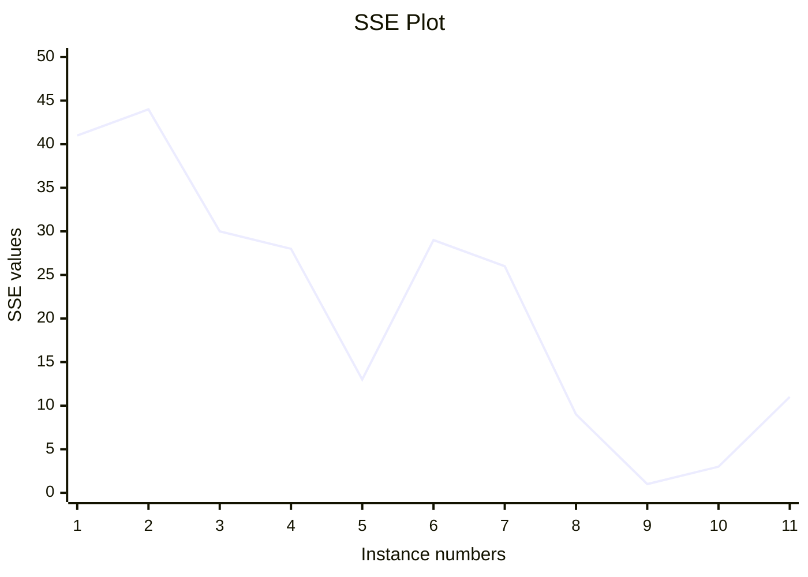

# Machine Learning (WiSe 2025/2026)

Author: Suvansh Shukla  
Matriculation No. 256245

---

## Assignment 2 Task 2.3

| Nr. | y | ˆy1 | ˆy2 | ˆy3 | ˆy4 | ˆy5 | ˆy6 | ˆy7 | ˆy8 | ˆy9 | ˆy10 | ˆy11 |
|-----|---|-----|-----|-----|-----|-----|-----|-----|-----|-----|------|------|
| 1 |  1 |  1 |  0 |  0 | - 2 |  1 | - 2 | - 3 | - 1 |  1 |  0 |  0 | - 2 |
| 2 |  4 |  0 |  1 |  0 |  3 |  4 |  2 |  1 |  2 |  4 |  3 |  3 |
|  3 |  3 | - 1 |  0 |  1 |  0 |  0 | - 1 |  2 |  2 |  3 |  2 |  3 |
|  4 |  7 |  4 |  2 |  4 |  4 |  5 |  7 |  7 |  7 |  6 |  7 |  6 |

### Formula for SSE:

$SSE_j = \sum_i (y_i - \hat{y_{ij}})^2$

Calculating SSE for each parameter:

$SSE_1 = ((1−1)^2+(4−0)^2+(3+1)^2+(7−4)^2=0+16+16+9=41$

$SSE_2 = (1−0)^2+(4−1)^2+(3−0)^2+(7−2)^2=1+9+9+25=44$

$SSE_3 = (1−0)^2+(4−0)^2+(3−1)^2+(7−4)^2=1+16+4+9=30$

$SSE_4 = (1+2)^2+(4−3)^2+(3−0)^2+(7−4)^2=9+1+9+9=28$

$SSE_5 = (1−1)^2+(4−4)^2+(3−0)^2+(7−5)^2=0+0+9+4=13$

$SSE_6 = (1+2)^2+(4−2)^2+(3+1)^2+(7−7)^2=9+4+16+0=29$

$SSE_7 = (1+3)^2+(4−1)^2+(3−2)^2+(7−7)^2=16+9+1+0=26$

$SSE_8 = (1+1)^2+(4−2)^2+(3−2)^2+(7−7)^2=4+4+1+0=9$

$SSE_9 = (1−1)^2+(4−4)^2+(3−3)^2+(7−6)^2=0+0+0+1=1$

$SSE_{10} = (1−0)^2+(4−3)^2+(3−2)^2+(7−7)^2=1+1+1+0=3$

$SSE_{11} = (1+2)^2+(4−3)^2+(3−3)^2+(7−6)^2=9+1+0+1=11$

### Plotting the points on a graph

