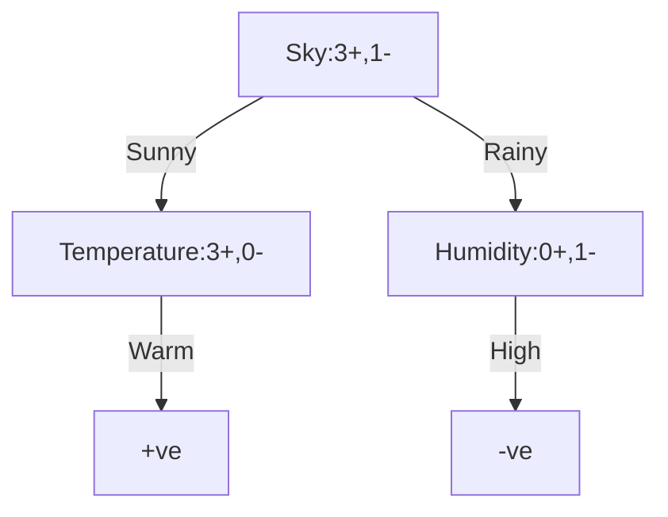

# Machine Learning (WiSe 2025/2026)

Author: Suvansh Shukla  
Matriculation No. 256245

---

## Assignment 4 Task 4.3

The following are the given features:

- Sky (Sunny, Cloudy, Rainy)
- Temperature (Warm, Cold)
- Humidity (High, Normal)
- Wind (Strong, Weak)
- Forecast (Same, Change)

The following instances are given:

X1 = <Sunny, Warm, Normal, Strong, Warm, Same> Y1 = +
X2 = <Sunny, Warm, High, Strong, Warm, Same> Y2 = +
X3 = <Rainy, Cold, High, Strong, Warm, Change> Y3 = -
X4 = <Sunny, Warm, High, Strong, Cool, Change> Y4 = +

Below is what my decision tree looks like (according to the ID3 algorithm):

Here's how to calculate Entropy:

$Entropy(Sky) = -\frac{3}{4} . log_2\frac{3}{4} - \frac{1}{4} . log_2\frac{1}{4}$
$Entropy(Sky) = -(0.75) . (-0.415) - (0.25) . (-2)$
$Entropy(Sky) = 0.81125$

And here's the entropy for it's next two nodes:

$Entropy(Temperature) = 0$  
$Entropy(Humidity) = 0$

To calculate Information Gain we use:

$Gain(S,A) \equiv Entropy(S) - \sum_{v \epsilon Values(A)} \frac{|S_v|}{|S|}Entropy(S_v)$

So by my calculations:

$Gain(Sky,Temperature) \equiv Entropy(Sky) - 0$
$Gain(Sky,Humidity) \equiv Entropy(Sky) - 0$

Thus overall Gain = $Entropy(Sky)$ = 0.81125

