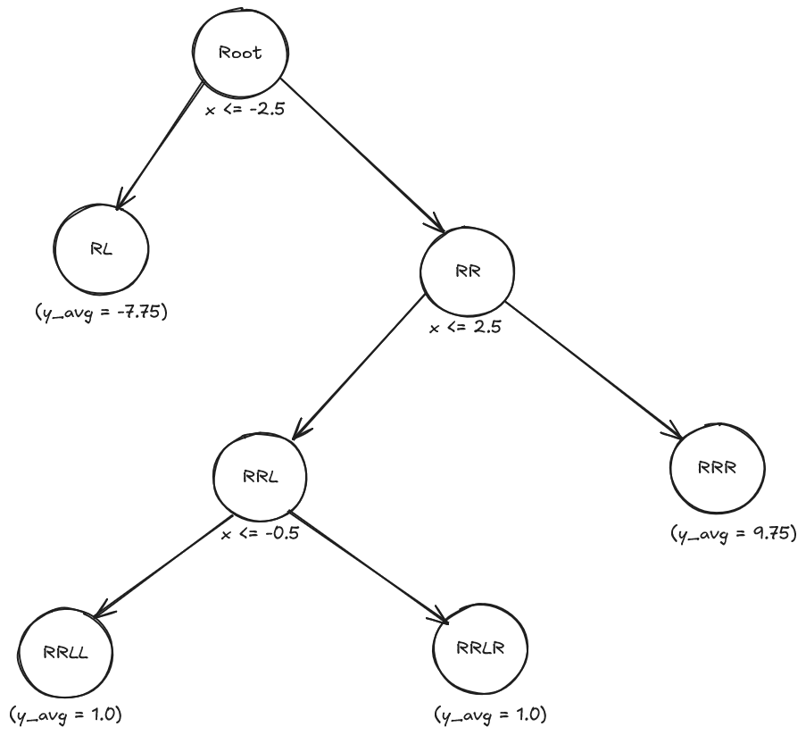

# Machine Learning (WiSe 2025/2026)

Author: Suvansh Shukla  
Matriculation No. 256245

---

## Assignment 5 Task 5.4

Given mathematical function:

$f(x) = \frac{1}{4}(x^3-3x)+1$

### (a)

For x = -4:

```math
f(-4) = 0.25 * (-64 + 12) +1
f(-4) = -12
```

For x = -3:

```math
f(-3) = 0.25 * ((-3)^3 - 3(-3)) +1
f(-3) = -3.5
```

For x = -2:

```math
f(-2) = 0.25 * ((-2)^3 - 3(-2)) +1
f(-2) = 0.5
```

For x = -1:

```math
f(-1) = 0.25 * ((-1)^3 - 3(-1)) +1
f(-1) = 1.5
```

For x = 0:

```math
f(-0) = 0.25 * ((-0)^3 - 3(-0)) +1
f(-0) = 1
```

For x = 1:

```math
f(1) = 0.25 * ((1)^3 - 3(1)) +1
f(1) = 0.5
```

For x = 2:

```math
f(2) = 0.25 * ((2)^3 - 3(2)) +1
f(2) = 1.5
```

For x = 3:

```math
f(3) = 0.25 * ((3)^3 - 3(3)) +1
f(3) = 5.5
```

For x = 4:

```math
f(4) = 0.25 * ((4)^3 - 3(4)) +1
f(4) = 14
```

### (b)

Given MSE function is:

$\frac{1}{N}\sum_{i}^{N}(y_{avg}-y_i)^2$

Considering our first split to be at -2.5, our tree would split the given values like so:

{-4, -3}    {-2, -1, 0, 1, 2, 3, 4}

here $y_{avg}$ would be calculated like so:

$y_{avg} = \frac{y_{-4} + y_{-3}}{2}$

$y_{avg} = \frac{-12 + (-3.5)}{2}$

Therefore $y_{avg} = -7.75$

Then we calculate MSE for the entire dataset using $y_{avg}$ for the entire dataset.

So, MSE = 42.17

Now the cost to split a node can be calculated using weighted MSE for every node.

$Cost(s) = \frac{N_L}{N}.MSE(R_L)+\frac{N_R}{N}.MSE(R_R)$

where $R_L$ and $R_R$ are the left and right child nodes, and $N_L$ and $N_R$ are their respective sample sizes.  
**The constraint is that each child node must contain at least two values.**  

Thus recursively generating the entire tree yeilds the following:

| Leaf Node | Region (x values)             | Prediction ($y_{avg}$) | MSE     |
| --------- | ----------------------------- | ---------------------- | ------- |
| $R_L$     | x≤−2.5 (i.e., x∈{−4,−3})      | −7.75                  | 18.0625 |
| $R_{RR}$  | x>2.5 (i.e., x∈{3,4})         | 9.75                   | 18.0625 |
| $R_{RLL}$ | −2.5<x≤−0.5 (i.e., x∈{−2,−1}) | 1.0                    | 0.2500  |
| $R_{RLR}$ | −0.5<x≤2.5 (i.e., x∈{0,1,2})  | 1.0                    | 0.1667  |

Here's what the tree would look like:



